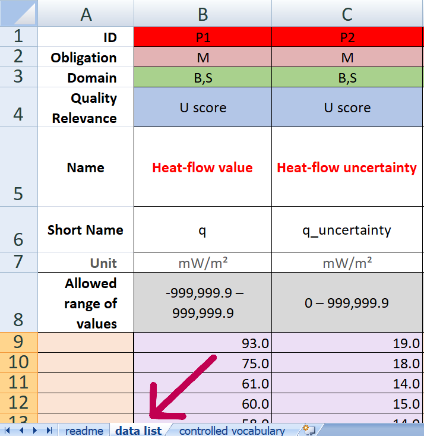

# hfqa_tool

- [Overview](#overview)
- [Documentation](#documentation)
- [System Requirements](#system-requirements)
- [Installation Guide](#installation-guide)
- [Running code](#running-code)
- [Setting up the development environment](#setting-up-the-development-environment)
- [Precaution](#precaution)
- [License](#license)
- [Issues](ISSUES.md)

# Overview

**Heat Flow Quality Analysis Toolbox** `hfqa_tool` is a Python package containing tools for validating and evaluating the quality of heat flow data. It is designed for researchers and professionals. `hfqa_tool` simplifies heat flow data analysis by providing standardized and reproducible quality checks. This is developed in compliance with the paper by Fuchs et al. (2023) titled "[Quality-assurance of heat-flow data: The new structure and evaluation scheme of the IHFC Global Heat Flow Database](https://doi.org/10.1016/j.tecto.2023.229976)," published in Tectonophysics 863: 229976. Also revised for the newer release 2024. There are mainly 2 functions defined in this tool with description as follows:

- `vocabulary_check()`: This set of code has been developed to check whether all the values entered in a Heatflow database adhere to a controlled vocabulary and proper structure described in the aforementioned scientific paper. It generates an error message for each entry where the value entered is out of bounds and does not meet the assigned criteria. The code also enables checking the vocabulary for multiple values entered in a single column for a particular Heatflow data entry.
It's a recommended prerequisite before calculating 'Quality Scores' for a given Heatflow dataset.

- `quality_scores()`: This code has been developed to assess the quality of the Heatflow database in terms of U-score (Uncertainty quantification), M-Score (Methodological quality), and P-Flags (Perturbation effects) adhering to the data structure described in the aforementioned scientific paper.

# Documentation
The official documentation with usage is at: 
ReadTheDocs: 

The list of Co-Authors involved in developing this toolbox are mentioned in [AUTHORs.md](https://github.com/sfchishti/hfqa_tool/blob/main/AUTHORs.md)

# System Requirements
## Hardware requirements
`hfqa_tool` package requires only a standard computer with enough RAM to support the in-memory operations.

## Software requirements
### OS Requirements
This package is supported for *Windows*, *macOS* and *Linux*. The package has been tested on the following systems:
+ Windows: Windows 10 Pro
+ Linux: Ubuntu 

### Python Dependencies
`hfqa_tool` mainly depends on the Python scientific computing and file handling stack.

```
numpy>=1.18.0
pandas>=1.0.0
openpyxl>=3.0.0
math
datetime
glob
os
warnings
multiprocessing
tqdm

# 'glob', 'os', 'warnings', 'datetime', 're' and 'math' are part of the standard library
```

# Installation Guide:

### Install from PyPi
```
#pip3 install hfqa_tool
pip3 install git+https://github.com/sfchishti/hfqa_tool.git
```

### Install from Github
```
git clone https://github.com/sfchishti/hfqa_tool.git
```
```
cd hfqa_tool
```
```
python setup.py install --user
```
- `sudo`, if required
- `python3 setup.py build_ext --inplace  # for cython`, if you want to test in-place, first execute this


# Running code
## Option 1: 
### Cloning .git with Multiprocessing
- Follow steps from [Install from Github](#install-from-github).
- Run `python` in shell
- ```
  from hfqa_tool import main
  main()
  ```
- When prompted with `Please enter the file directory:`, provide the directory/location of your Heatflow data files.
- If running on Linux or Mac OS, use forward slashes /. On Windows, backward slashes \ will work fine when assigning your directory.
- Get results in the same folder with execution time displayed :)

## Option 2: 
### Directly without Multiprocessing
- Download `hfqa_tool` repository
- Run all sections of the code of notebooks on conda environment. Descriptions and guidelines are provided with the code.
- When prompted with `Please enter the file directory:`, provide the directory/location of your Heatflow data files. This can be done in the last section (*10. hfqa_tool function*) of the code, both in [Vocabulary_check](https://github.com/sfchishti/hfqa_tool/blob/main/notebooks/Vocabulary_check.ipynb), and [Combined_score](https://github.com/sfchishti/hfqa_tool/blob/main/notebooks/Combined_score.ipynb) code.
- If running on Linux or Mac OS, use forward slashes /. On Windows, backward slashes \ will work fine when assigning your directory.
- Get results in the same folder :)

### PyPi
- In Python terminal run code from [Install from PyPi](#install-from-pypi)
```
import hfqa_tool
```
-  When prompted with `Please enter the file directory:`, provide the directory/location of your Heatflow data files. If running on Linux or Mac OS, use forward slashes /. On Windows, backward slashes \ will work fine when assigning your directory.
- Get results in the same folder :)

# Setting up the development environment:
### Prerequisites

Make sure you have the following installed:

- [Python](https://www.python.org/) 3.x (Ensure you have the correct version)
- [pip](https://pip.pypa.io/en/stable/) (Python package installer)
- [virtualenv](https://virtualenv.pypa.io/en/stable/) (Optional but recommended)
- Git

### Cloning the Repository

Clone the project repository using Git:

```
git clone https://github.com/sfchishti/hfqa_tool.git
cd hfqa_tool
```

### Select branch

```
git checkout contribute
```
You're now on development mode. Make sure to make proper commit message and 
check your credentials as committer. For example:
```
git commit -m "Vocab_check.ipynb:your_commit"
```
To configue yourself as committer try:
```
git config user.name "Your_name"
git config user.email "your_email@example.com"
```
```
git push
```

    
# Precaution
- The worksheet of Heat flow data must be named "data list", to execute conversion of the data set in machine readable format (here, *.csv*). Else the function `convert2UTF8csv(folder_path)` will not work.

- When a new data release occurs and the relevancy (indicated by *'Obligation'*) of a column in the HF data structure is updated, make sure to place the data structure files with the updated column relevancy into separate folders before running the code.

# License
**Copyright © 2024 German Geoscience Research Center (GFZ)**

This work is licensed under multiple licenses:


- The source codes are licensed under **[MIT](license/MIT.txt)**.
- The documentation and the images are licensed under **[CC-BY-4.0](license/CC-BY-4.0.txt)**.
